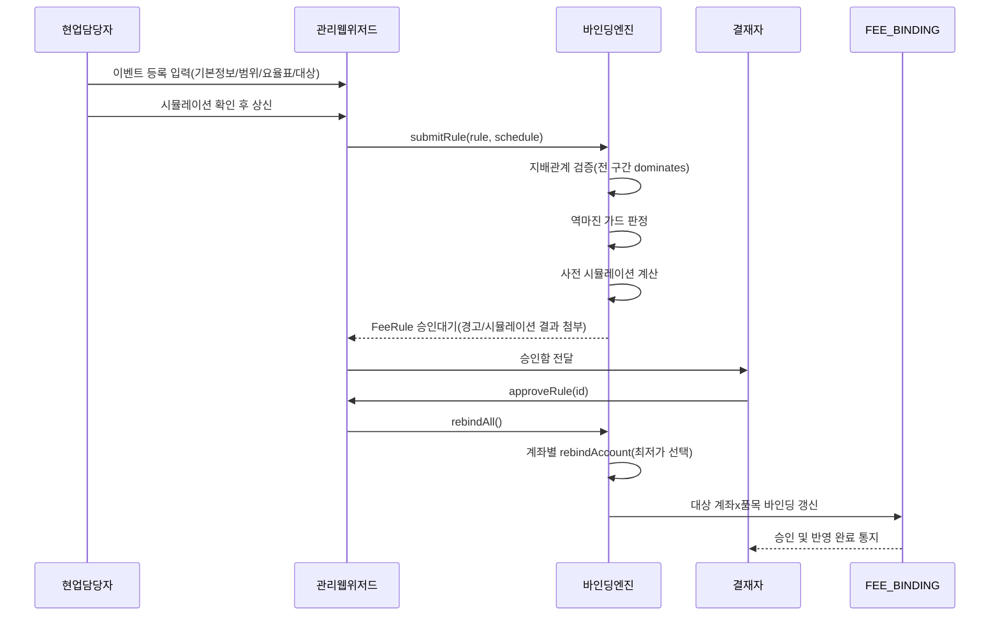
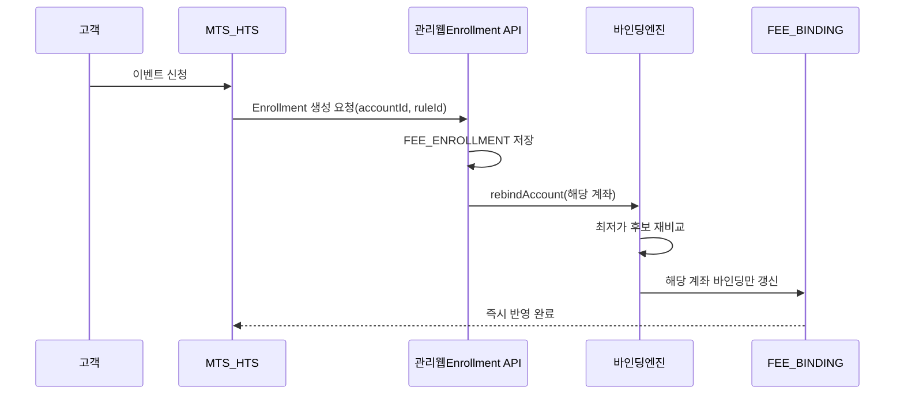
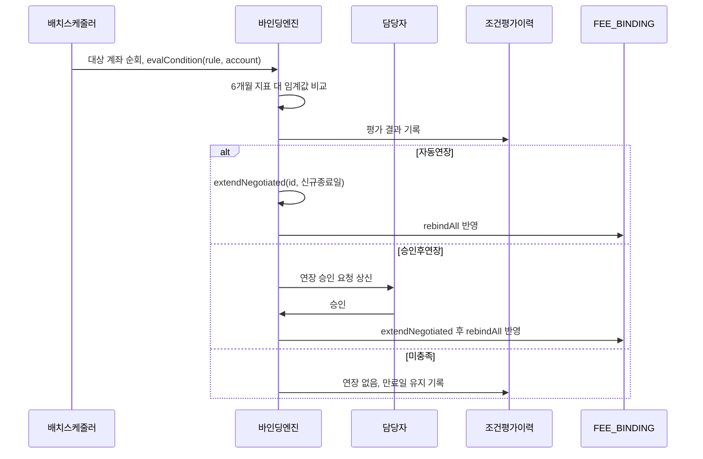
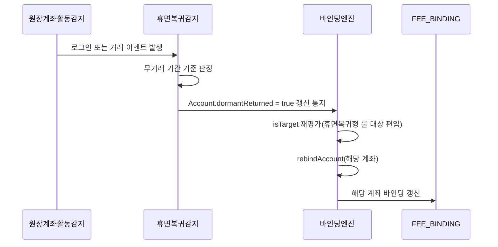
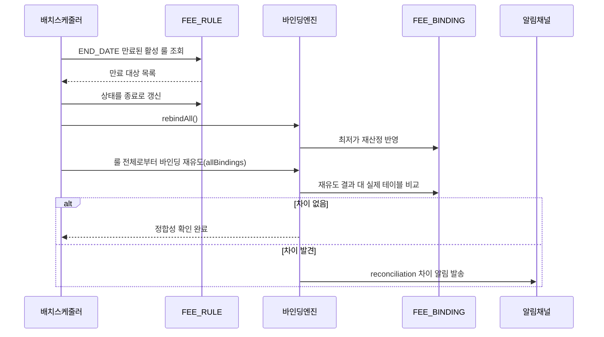
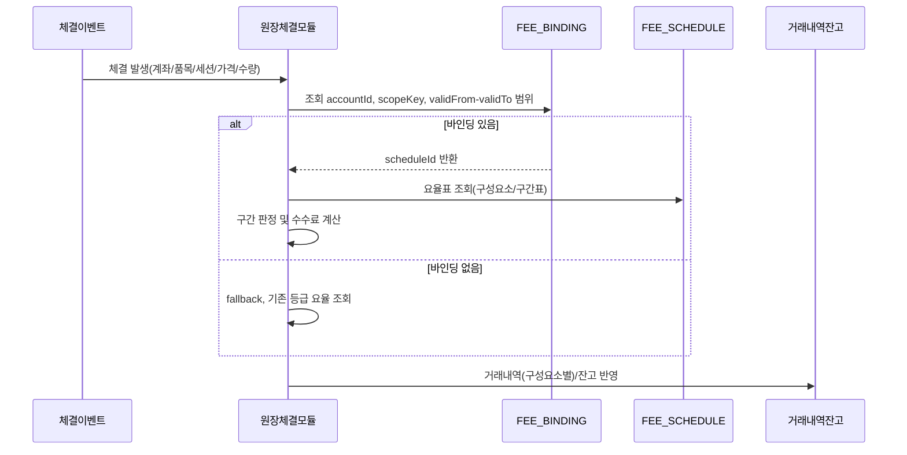

# 업무 프로세스 정의서 — 수수료 이벤트 정형화 플랫폼

- 작성일: 2026-07-04
- 대상 독자: 원장 개발팀, 현업(수수료 담당·결재자)
- 근거 문서:
  - 설계 스펙: `docs/superpowers/specs/2026-07-04-fee-event-platform-design.md`
  - 확정 타입: `src/domain/types.ts`
  - 확정 로직: `src/store/useStore.ts`(`submitRule`/`approveRule`/`rejectRule`/`extendNegotiated`/`rebindAll`), `src/domain/binding.ts`(`rebindAccount`, `scopeMatches`, `isTarget`), `src/domain/dominance.ts`(`dominates`, `probePrices`)

이 문서는 v0 프로토타입(Task 1~10)에서 검증된 워크플로우를 실 시스템 이관 관점에서 6개 업무 프로세스로 재정리한다. 각 프로세스는 [트리거 → 행위자 → 시스템 처리 → 산출물] 표, mermaid sequenceDiagram, 현행(as-is) 대비 변경점 순으로 기술한다.

## 컨트롤러 확정 사항 (전 프로세스 공통 전제)

1. **세션 차원 미사용**: `ScopeSelector.sessions`는 계좌×품목 바인딩 매칭에 사용하지 않는다(`scopeMatches()`가 assetClass/exchanges/currencies/products/excludeProducts만 검사하고 sessions는 검사하지 않음 — 코드로 확정된 v0 설계). 세션별 차등은 `FeeSchedule` 내부(구성요소/구간표) 키 차원으로 흡수한다. 상세는 `docs/table-design.md`의 "원장-플랫폼 계약" 절 참조.
2. **등록(상신) 시점 지배관계 검증 강제**: `submitRule`에서 대상 범위가 겹치는 기존 활성 룰 전 구간 대비 신규 요율표가 같거나 싸야(`dominates`) 승인 가능. 교차 구간(A가 저가 구간, B가 고가 구간에서 각각 유리)은 v1 미지원 — 다중 바인딩 + `min()` 확장은 향후 과제.
3. **최저가 비교는 union probe grid 기준**: 후보 요율표 전체의 구간 경계를 합친 검사 가격 목록(`probePrices`)에서 평균 고객부과액을 비교한다(`rebindAccount`).
4. **협수 조건**: 해외주식=6개월 평균 자산, 그 외=6개월 약정액, 롤링 윈도우. 지표는 원장 집계 테이블에서 일 단위 적재(`Account.metric6mAsset`/`metric6mVolume`).

---

## ① 이벤트 등록~승인~바인딩 반영

현업 기안 → 결재 → `rebindAll`.

| 트리거 | 행위자 | 시스템 처리 | 산출물 |
|---|---|---|---|
| 신규 이벤트/협수/기본수수료 변경 필요 인지 | 현업 담당자(기안자) | 이벤트 등록 위저드 입력: 기본정보 → 적용범위 → 요율표 → 대상 → 시뮬레이션 확인 | `FeeRule`(상태=기안) + `FeeSchedule` 초안 |
| 위저드 6단계 상신 클릭 | 현업 담당자 | `submitRule(rule, schedule)`: ①지배관계 검증(범위가 겹치는 기존 활성 룰 대비 전 구간 `dominates`) ②역마진 가드(회사부담 유관기관분 > 자사 수취분 여부) ③사전 시뮬레이션(대상 계좌수 × 표본 체결 기준 감면액) | `FeeRule`(상태=승인대기, `warnings.dominance`/`warnings.reverseMargin`/`sim` 필드 채움) |
| 상신 완료 | 결재자 | 승인함에서 시뮬레이션·역마진 경고·지배관계 검증 결과를 확인 후 승인/반려 판단 | `FeeRule`(상태=활성 또는 반려) + 감사로그(`log`) |
| 승인(활성 전환) | 바인딩엔진(자동) | `rebindAll()` → 계좌×품목 전체에 대해 `rebindAccount` 재실행: 범위가 겹치는 후보 룰들을 union probe grid로 비교해 최저가 승자 확정 | `FeeBinding` 갱신(영향받는 계좌×품목 전체), 감사로그 |

**현행(as-is) 대비 변경점**: 이벤트마다 개발 건으로 처리되던 방식을 데이터 등록(위저드)+결재 승인만으로 대체하고, 지배관계 검증을 상신 시점에 강제해 승인 후 바인딩이 항상 단일로 확정되도록 한다.

---

## ② 신청형 고객 신청

MTS/HTS → Enrollment → 해당 계좌 즉시 rebind.

| 트리거 | 행위자 | 시스템 처리 | 산출물 |
|---|---|---|---|
| 고객이 MTS/HTS에서 신청형 이벤트 신청 | 고객, MTS/HTS | Enrollment 생성 요청(accountId, ruleId, channel) 전송 | 신청 요청 |
| 신청 요청 수신 | 플랫폼(Enrollment API) | `Enrollment` 레코드 저장(`accountId`, `ruleId`, `enrolledAt`, `channel`) | `Enrollment` 신규 행 |
| Enrollment 저장 직후 | 바인딩엔진(자동) | 해당 계좌만 대상으로 `rebindAccount` 즉시 실행 — `isTarget()`이 신청형 룰에 대해 Enrollment 존재 여부로 판정, 최저가 재비교 | 해당 계좌의 `FeeBinding`만 갱신 |

**현행(as-is) 대비 변경점**: 신청형 이벤트가 별도 시스템·수작업 등록 후 익일 반영되던 지연을 없애고, Enrollment 저장 즉시 해당 계좌만 rebind하여 near-real-time으로 반영한다.

---

## ③ 협수 조건 평가~연장

배치 평가 → 충족 시 자동/승인후 연장 → rebind.

| 트리거 | 행위자 | 시스템 처리 | 산출물 |
|---|---|---|---|
| 평가주기 도래(배치 스케줄) | 배치 스케줄러 | 대상 계좌별 `evalCondition(rule, account)`: `metric6mAsset`(해외주식) 또는 `metric6mVolume`(그 외)을 임계값과 비교 | 조건 평가 결과 |
| 조건 충족 판정 | 바인딩엔진(자동) | `action`이 `자동연장`이면 `extendNegotiated(id, 신규종료일)` 즉시 실행 | `FeeRule.endDate` 갱신 + 로그 |
| 조건 충족 판정 | 바인딩엔진 → 담당자 | `action`이 `승인후연장`이면 연장 승인 요청 상신, 담당자 승인 후 `extendNegotiated` 실행 | 승인 이력 + `FeeRule.endDate` 갱신 |
| 조건 미충족 판정 | 바인딩엔진(자동) | 연장 없이 기존 `endDate` 유지 → 만료 시 ⑤ 일 배치에서 종료 처리 | 평가 결과 이력만 기록 |
| 연장 확정 | 바인딩엔진(자동) | `rebindAll()` 반영 | `FeeBinding` 갱신 |

**현행(as-is) 대비 변경점**: 담당자가 수수료 수익·재산현황을 엑셀로 sum-up해 수작업으로 연장하던 방식을 배치의 자동 조건 평가와 이력 보존으로 대체한다.

---

## ④ 휴면복귀 감지 적용

감지 → 휴면복귀형 룰 대상 편입 → rebind.

| 트리거 | 행위자 | 시스템 처리 | 산출물 |
|---|---|---|---|
| 로그인 또는 거래 이벤트 발생 | 원장(계좌 활동 감지 모듈) | 무거래 기간 기준으로 휴면복귀 여부 판정(기준 정의는 v1 확정 과제, 스펙 10장) | 휴면복귀 판정 신호 |
| 휴면복귀 판정 확정 | 플랫폼(감지 연동) | `Account.dormantReturned = true` 갱신 | `Account` 상태 갱신 |
| 플래그 갱신 직후 | 바인딩엔진(자동) | `isTarget()` 재평가 — 휴면복귀형 룰은 `dormantReturned` 값으로 대상 여부 판정되므로 즉시 대상 편입, 해당 계좌 `rebindAccount` 실행 | 해당 계좌 `FeeBinding` 갱신 |

**현행(as-is) 대비 변경점**: 휴면복귀 감지·재적용 로직이 없거나 이벤트별 개별 개발이 필요했던 상태에서, 휴면복귀형이 공통 룰 모델의 적용형태로 존재해 감지 즉시 자동 대상 편입이 가능해진다.

---

## ⑤ 일 배치 (만료 처리 + reconciliation)

| 트리거 | 행위자 | 시스템 처리 | 산출물 |
|---|---|---|---|
| 매일 새벽 배치 스케줄 | 배치 스케줄러 | `endDate < TODAY`인 활성 룰을 상태=종료로 전환 | `FeeRule.status = 종료` |
| 만료 처리 직후 | 바인딩엔진(자동) | `rebindAll()` — 만료된 룰이 제외된 상태로 최저가 재산정 | `FeeBinding` 갱신 |
| 만료 처리와 별개로 매 배치 회차 | 바인딩엔진(자동) | reconciliation: 룰 전체로부터 바인딩을 처음부터 재유도(`allBindings`)하여 실제 `FeeBinding` 테이블과 비교 | 비교 결과 |
| 비교 결과 불일치 발견 | 바인딩엔진 → 알림채널 | 차이 발견 시 알림 발송(트리거 누락 안전망) | 알림 + `FEE_RECONCILE_LOG` 기록 |

**현행(as-is) 대비 변경점**: 배치가 유일한 반영 경로였던 구조를 이벤트 드리븐(즉시 반영)이 전담하도록 바꾸고, 일 배치는 만료 처리와 안전망 역할(reconciliation)로 범위를 축소한다.

---

## ⑥ 체결 시 수수료 적용 (원장 관점)

바인딩 조회 → 구간 판정 → 수수료 계산 → 거래내역/잔고 반영.

| 트리거 | 행위자 | 시스템 처리 | 산출물 |
|---|---|---|---|
| 체결 발생 | 원장 체결모듈 | `FEE_BINDING` 조회: `WHERE account_id=? AND scope_key=? AND valid_from<=today AND today<=valid_to` | 바인딩 1건 또는 0건 |
| 바인딩 조회 성공 | 원장 체결모듈 | `scheduleId`로 요율표 조회 → 구간표는 체결가 기준 구간 판정(`calcFee`와 동일 로직) → 구성요소별 금액 산출 | 구성요소별 수수료 라인(`customerTotal`/`companyBorne`) |
| 바인딩 조회 실패(0건) | 원장 체결모듈 | fallback: 기존 등급 요율표 조회(원장 수정은 이 분기 한 곳뿐) | 기존 방식 수수료 |
| 수수료 산출 완료 | 원장 체결모듈 | 거래내역/잔고에 near-instant 반영 | 거래내역, 잔고 갱신 |

**현행(as-is) 대비 변경점**: 체결 시 등급별 요율표를 직접 조회·계산하던 로직을 단일 바인딩 조회로 대체해 원장에서 룰 평가 로직을 제거하고, 바인딩이 없을 때만 기존 등급 fallback으로 무중단 전환한다.
