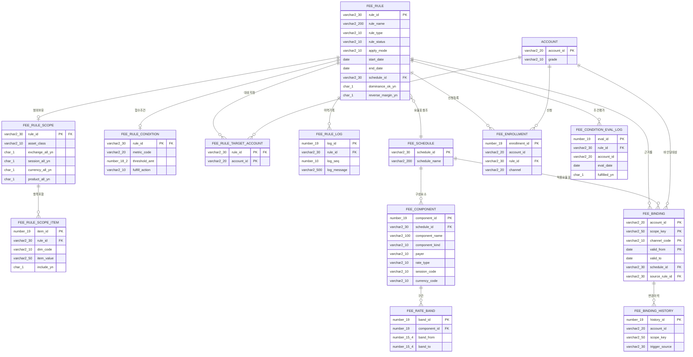

# 테이블 설계서 — 수수료 이벤트 정형화 플랫폼

- 작성일: 2026-07-04
- 대상 독자: 원장 개발팀, 현업(수수료 담당)
- DBMS 기준: Oracle (사내 표준 미확정 시 기본값. 스펙 10장 "원장 실제 기술 스택 확인 후 물리 설계 확정" 참고)
- 근거 문서:
  - 설계 스펙: `docs/superpowers/specs/2026-07-04-fee-event-platform-design.md` (4장 도메인 모델, 5장 바인딩 엔진, 7장 원장 연계)
  - 확정 타입: `src/domain/types.ts`
  - 확정 로직: `src/domain/binding.ts`(`rebindAccount`, `scopeMatches`, `isTarget`), `src/domain/dominance.ts`(`probePrices`, `dominates`), `src/store/useStore.ts`

`types.ts`가 정의하는 6개 도메인 모델(`FeeRule`, `ScopeSelector`, `FeeSchedule`, `Enrollment`, `NegotiatedCondition`, `FeeBinding`)을 물리 테이블로 전개한다. `Account`/`Product`/`Execution`은 원장이 이미 보유한 기존 엔티티로 간주하고 FK 참조 대상으로만 다루며, 본 문서 범위에서 새로 설계하지 않는다(단, 협수 조건 지표 적재를 위한 확장은 "원장 연계" 절에서 별도 제안).

## 0. 엔티티 → 물리 테이블 매핑 총괄

| `types.ts` 엔티티 | 물리 테이블 | 비고 |
|---|---|---|
| `FeeRule` | `FEE_RULE` | 상태·기간·적용형태·경고/시뮬레이션 필드 |
| `FeeRule.scope` (`ScopeSelector`) | `FEE_RULE_SCOPE` + `FEE_RULE_SCOPE_ITEM` | 리스트 필드(exchanges/sessions/currencies/products/excludeProducts)는 자식 테이블로 정규화 |
| `FeeRule.targetAccountIds` | `FEE_RULE_TARGET_ACCOUNT` | 일괄적용형 bulk 대상. 행 없음 = 전체 대상(코드의 `!rule.targetAccountIds` 분기와 동일 semantics) |
| `FeeRule.log` | `FEE_RULE_LOG` | 감사 로그(LOG 성격) |
| `FeeSchedule` | `FEE_SCHEDULE` | 요율표 헤더 |
| `FeeSchedule.components` (`FeeComponent`) | `FEE_COMPONENT` | 요율 구성요소 자식 테이블 |
| `FeeComponent.bands` (`RateBand`) | `FEE_RATE_BAND` | 구간표 자식 테이블(`FEE_COMPONENT`의 손자 테이블) |
| `Enrollment` | `FEE_ENROLLMENT` | 계좌×룰 연결 |
| `FeeRule.condition` (`NegotiatedCondition`) | `FEE_RULE_CONDITION` | NEGOTIATED 전용 1:0..1 |
| (조건 평가 이력, 신규) | `FEE_CONDITION_EVAL_LOG` | 협수 조건 평가 이력(LOG 성격) |
| `FeeBinding` | `FEE_BINDING` | **원장-플랫폼 계약**. 4절에서 별도 상세 |
| (바인딩 변경 이력, 신규) | `FEE_BINDING_HISTORY` | 바인딩 변경 이력(LOG 성격) |
| (reconciliation 결과, 신규) | `FEE_RECONCILE_LOG` | 업무 프로세스 ⑤의 산출물 |

---

## 1. DDL 초안 (Oracle)

의존순서(부모 먼저 생성)로 기술한다.

### 1.1 FEE_SCHEDULE / FEE_COMPONENT / FEE_RATE_BAND (요율표)

```sql
CREATE TABLE FEE_SCHEDULE (
    SCHEDULE_ID    VARCHAR2(30)   NOT NULL,
    SCHEDULE_NAME  VARCHAR2(200)  NOT NULL,
    CREATED_AT     TIMESTAMP      DEFAULT SYSTIMESTAMP NOT NULL,
    CONSTRAINT PK_FEE_SCHEDULE PRIMARY KEY (SCHEDULE_ID)
);

CREATE SEQUENCE SEQ_FEE_COMPONENT_ID;

CREATE TABLE FEE_COMPONENT (
    COMPONENT_ID    NUMBER(19)     NOT NULL,
    SCHEDULE_ID     VARCHAR2(30)   NOT NULL,
    COMPONENT_NAME  VARCHAR2(100)  NOT NULL,   -- 예: 자사 수수료, 거래소, 예탁원, 제세금
    COMPONENT_KIND  VARCHAR2(10)   NOT NULL,   -- 자사 / 유관기관 / 세금
    PAYER           VARCHAR2(10)   NOT NULL,   -- 고객부과 / 회사부담 / 면제
    RATE_TYPE       VARCHAR2(10)   NOT NULL,   -- 정률 / 정액 / 구간표
    RATE_BP         NUMBER(9,4),               -- 정률: 거래대금 대비 bp
    FLAT_AMOUNT     NUMBER(15,2),              -- 정액: 계약(주문)당 금액
    MIN_FEE         NUMBER(15,2),              -- 최소수수료
    SESSION_CODE    VARCHAR2(10),              -- NULL=전 세션 공통(컨트롤러 확정 1 반영: 세션 차등은 여기서 표현)
    CURRENCY_CODE   VARCHAR2(10),              -- NULL=전 통화 공통
    DISPLAY_ORDER   NUMBER(5)      DEFAULT 0 NOT NULL,
    CONSTRAINT PK_FEE_COMPONENT PRIMARY KEY (COMPONENT_ID),
    CONSTRAINT FK_FEE_COMPONENT_SCHEDULE FOREIGN KEY (SCHEDULE_ID)
        REFERENCES FEE_SCHEDULE (SCHEDULE_ID),
    CONSTRAINT CK_FEE_COMPONENT_KIND CHECK (COMPONENT_KIND IN ('자사','유관기관','세금')),
    CONSTRAINT CK_FEE_COMPONENT_PAYER CHECK (PAYER IN ('고객부과','회사부담','면제')),
    CONSTRAINT CK_FEE_COMPONENT_RATE_TYPE CHECK (RATE_TYPE IN ('정률','정액','구간표'))
);
CREATE INDEX IDX_FEE_COMPONENT_SCHEDULE ON FEE_COMPONENT (SCHEDULE_ID);

CREATE SEQUENCE SEQ_FEE_RATE_BAND_ID;

CREATE TABLE FEE_RATE_BAND (
    BAND_ID       NUMBER(19)    NOT NULL,
    COMPONENT_ID  NUMBER(19)    NOT NULL,
    BAND_SEQ      NUMBER(5)     NOT NULL,      -- 평가/표시 순서
    BAND_FROM     NUMBER(15,4)  NOT NULL,
    BAND_TO       NUMBER(15,4),                -- NULL=상단 무제한 (RateBand.to: number|null과 동일)
    RATE_BP       NUMBER(9,4),
    FLAT_AMOUNT   NUMBER(15,2),
    CONSTRAINT PK_FEE_RATE_BAND PRIMARY KEY (BAND_ID),
    CONSTRAINT FK_FEE_RATE_BAND_COMPONENT FOREIGN KEY (COMPONENT_ID)
        REFERENCES FEE_COMPONENT (COMPONENT_ID)
);
CREATE INDEX IDX_FEE_RATE_BAND_COMPONENT ON FEE_RATE_BAND (COMPONENT_ID, BAND_FROM);
```

`FeeComponent`에는 v0 프로토타입 타입에 없는 `SESSION_CODE`/`CURRENCY_CODE`를 실 설계에서 추가했다. 스펙 4.3 "통화·세션별 차등은 요율표 내부의 키 차원으로 표현한다"를 물리적으로 만족시키려면 구성요소 단위의 키 컬럼이 필요하지만, v0 프로토타입 `FeeComponent`는 이를 구현하지 않았다(단일 요율만 표현). 실 시스템에서는 이 두 컬럼을 nullable로 추가하고, 원장 조회 로직은 `SESSION_CODE`가 NULL이 아니면 체결 세션과 일치하는 구성요소를 우선 매칭하도록 확장한다.

### 1.2 FEE_RULE / FEE_RULE_SCOPE / FEE_RULE_SCOPE_ITEM / FEE_RULE_TARGET_ACCOUNT / FEE_RULE_CONDITION / FEE_RULE_LOG

```sql
CREATE TABLE FEE_RULE (
    RULE_ID            VARCHAR2(30)   NOT NULL,
    RULE_NAME          VARCHAR2(200)  NOT NULL,
    RULE_TYPE          VARCHAR2(10)   NOT NULL,   -- BASE / EVENT / NEGOTIATED
    RULE_STATUS        VARCHAR2(10)   NOT NULL,   -- 기안/승인대기/활성/반려/종료
    APPLY_MODE         VARCHAR2(10)   NOT NULL,   -- 신청형/가입형/휴면복귀형/일괄적용형
    START_DATE         DATE           NOT NULL,
    END_DATE           DATE           NOT NULL,
    SCHEDULE_ID        VARCHAR2(30)   NOT NULL,
    DOMINANCE_OK_YN    CHAR(1)        DEFAULT 'Y' NOT NULL,   -- warnings.dominance
    REVERSE_MARGIN_YN  CHAR(1)        DEFAULT 'N' NOT NULL,   -- warnings.reverseMargin
    SIM_TARGET_CNT     NUMBER(10),                            -- sim.targets
    SIM_SAVING_AMT     NUMBER(18,2),                           -- sim.saving
    CREATED_BY         VARCHAR2(50)   NOT NULL,
    CREATED_AT         TIMESTAMP      DEFAULT SYSTIMESTAMP NOT NULL,
    UPDATED_AT         TIMESTAMP      DEFAULT SYSTIMESTAMP NOT NULL,
    CONSTRAINT PK_FEE_RULE PRIMARY KEY (RULE_ID),
    CONSTRAINT FK_FEE_RULE_SCHEDULE FOREIGN KEY (SCHEDULE_ID)
        REFERENCES FEE_SCHEDULE (SCHEDULE_ID),
    CONSTRAINT CK_FEE_RULE_TYPE CHECK (RULE_TYPE IN ('BASE','EVENT','NEGOTIATED')),
    CONSTRAINT CK_FEE_RULE_STATUS CHECK (RULE_STATUS IN ('기안','승인대기','활성','반려','종료')),
    CONSTRAINT CK_FEE_RULE_APPLY_MODE CHECK (APPLY_MODE IN ('신청형','가입형','휴면복귀형','일괄적용형'))
);
CREATE INDEX IDX_FEE_RULE_ACTIVE ON FEE_RULE (RULE_STATUS, START_DATE, END_DATE);  -- rebindAll 활성룰 스캔
CREATE INDEX IDX_FEE_RULE_TYPE   ON FEE_RULE (RULE_TYPE);

CREATE TABLE FEE_RULE_SCOPE (
    RULE_ID           VARCHAR2(30) NOT NULL,
    ASSET_CLASS       VARCHAR2(10) NOT NULL,  -- 국내주식/해외주식/국내파생/해외파생/금현물
    EXCHANGE_ALL_YN   CHAR(1) DEFAULT 'N' NOT NULL,   -- exchanges === '*'
    SESSION_ALL_YN    CHAR(1) DEFAULT 'N' NOT NULL,   -- 참고용 저장만. 바인딩 매칭에는 미사용(컨트롤러 확정 1)
    CURRENCY_ALL_YN   CHAR(1) DEFAULT 'N' NOT NULL,
    CHANNEL_ALL_YN    CHAR(1) DEFAULT 'Y' NOT NULL,   -- 매체(주문채널) 전체 여부. 기본=전 매체. 'N'이면 SCOPE_ITEM의 CHANNEL 행 참조
    PRODUCT_ALL_YN    CHAR(1) DEFAULT 'N' NOT NULL,
    CONSTRAINT PK_FEE_RULE_SCOPE PRIMARY KEY (RULE_ID),
    CONSTRAINT FK_FEE_RULE_SCOPE_RULE FOREIGN KEY (RULE_ID) REFERENCES FEE_RULE (RULE_ID),
    CONSTRAINT CK_FEE_RULE_SCOPE_ASSET CHECK (ASSET_CLASS IN ('국내주식','해외주식','국내파생','해외파생','금현물'))
);

CREATE SEQUENCE SEQ_SCOPE_ITEM_ID;

CREATE TABLE FEE_RULE_SCOPE_ITEM (
    ITEM_ID     NUMBER(19)    NOT NULL,
    RULE_ID     VARCHAR2(30)  NOT NULL,
    DIM_CODE    VARCHAR2(10)  NOT NULL,   -- EXCHANGE / SESSION / CURRENCY / PRODUCT / CHANNEL
    ITEM_VALUE  VARCHAR2(50)  NOT NULL,   -- 거래소코드/세션코드/통화코드/품목(기초자산)코드
    INCLUDE_YN  CHAR(1)       NOT NULL,   -- Y=포함 리스트, N=제외 리스트(excludeProducts는 항상 PRODUCT+N)
    CONSTRAINT PK_FEE_RULE_SCOPE_ITEM PRIMARY KEY (ITEM_ID),
    CONSTRAINT FK_SCOPE_ITEM_RULE FOREIGN KEY (RULE_ID) REFERENCES FEE_RULE (RULE_ID),
    CONSTRAINT CK_SCOPE_ITEM_DIM CHECK (DIM_CODE IN ('EXCHANGE','SESSION','CURRENCY','PRODUCT','CHANNEL')),
    CONSTRAINT UQ_SCOPE_ITEM UNIQUE (RULE_ID, DIM_CODE, ITEM_VALUE, INCLUDE_YN)
);
CREATE INDEX IDX_SCOPE_ITEM_RULE  ON FEE_RULE_SCOPE_ITEM (RULE_ID, DIM_CODE);
CREATE INDEX IDX_SCOPE_ITEM_VALUE ON FEE_RULE_SCOPE_ITEM (DIM_CODE, ITEM_VALUE);  -- "이 종목이 걸린 룰" 역조회(민원 대응)

CREATE TABLE FEE_RULE_TARGET_ACCOUNT (
    RULE_ID     VARCHAR2(30)  NOT NULL,
    ACCOUNT_ID  VARCHAR2(20)  NOT NULL,          -- 원장 ACCOUNT 참조(크로스 스키마 시 FK 생략, 앱 검증)
    ADDED_AT    TIMESTAMP     DEFAULT SYSTIMESTAMP NOT NULL,
    CONSTRAINT PK_TARGET_ACCOUNT PRIMARY KEY (RULE_ID, ACCOUNT_ID),
    CONSTRAINT FK_TARGET_ACCOUNT_RULE FOREIGN KEY (RULE_ID) REFERENCES FEE_RULE (RULE_ID)
);
CREATE INDEX IDX_TARGET_ACCOUNT_ACCT ON FEE_RULE_TARGET_ACCOUNT (ACCOUNT_ID);
-- 일괄적용형 룰에서 이 테이블에 행이 없으면 "전체 대상"으로 해석한다
-- (isTarget()의 `!rule.targetAccountIds || rule.targetAccountIds.includes(acct.id)`와 동일 semantics).

CREATE TABLE FEE_RULE_CONDITION (
    RULE_ID         VARCHAR2(30)  NOT NULL,
    METRIC_CODE     VARCHAR2(20)  NOT NULL,  -- 6개월평균자산 / 6개월약정액
    THRESHOLD_AMT   NUMBER(18,2)  NOT NULL,
    FULFILL_ACTION  VARCHAR2(10)  NOT NULL,  -- 자동연장 / 승인후연장
    CONSTRAINT PK_FEE_RULE_CONDITION PRIMARY KEY (RULE_ID),
    CONSTRAINT FK_FEE_RULE_CONDITION_RULE FOREIGN KEY (RULE_ID) REFERENCES FEE_RULE (RULE_ID),
    CONSTRAINT CK_CONDITION_METRIC CHECK (METRIC_CODE IN ('6개월평균자산','6개월약정액')),
    CONSTRAINT CK_CONDITION_ACTION CHECK (FULFILL_ACTION IN ('자동연장','승인후연장'))
);
-- NEGOTIATED 타입 룰만 이 행을 가진다(1:0..1). 타 타입 룰의 RULE_TYPE 정합성은
-- Oracle CHECK로 교차 테이블 검증이 불가하므로 애플리케이션 레벨(또는 트리거)에서 강제한다.

CREATE SEQUENCE SEQ_FEE_RULE_LOG_ID;

CREATE TABLE FEE_RULE_LOG (
    LOG_ID       NUMBER(19)     NOT NULL,
    RULE_ID      VARCHAR2(30)   NOT NULL,
    LOG_SEQ      NUMBER(10)     NOT NULL,
    LOG_AT       TIMESTAMP      DEFAULT SYSTIMESTAMP NOT NULL,
    LOG_MESSAGE  VARCHAR2(500)  NOT NULL,   -- 예: "2026-07-04 기안 상신 (담당자)"
    ACTOR        VARCHAR2(50),
    CONSTRAINT PK_FEE_RULE_LOG PRIMARY KEY (LOG_ID),
    CONSTRAINT FK_FEE_RULE_LOG_RULE FOREIGN KEY (RULE_ID) REFERENCES FEE_RULE (RULE_ID)
);
CREATE INDEX IDX_FEE_RULE_LOG_RULE ON FEE_RULE_LOG (RULE_ID, LOG_SEQ);
```

### 1.3 FEE_ENROLLMENT / FEE_CONDITION_EVAL_LOG

```sql
CREATE SEQUENCE SEQ_FEE_ENROLLMENT_ID;

CREATE TABLE FEE_ENROLLMENT (
    ENROLLMENT_ID  NUMBER(19)    NOT NULL,
    ACCOUNT_ID     VARCHAR2(20)  NOT NULL,
    RULE_ID        VARCHAR2(30)  NOT NULL,
    ENROLLED_AT    TIMESTAMP     DEFAULT SYSTIMESTAMP NOT NULL,
    CHANNEL        VARCHAR2(20)  NOT NULL,   -- MTS/HTS/영업점/배치(bulk)
    CONSTRAINT PK_FEE_ENROLLMENT PRIMARY KEY (ENROLLMENT_ID),
    CONSTRAINT FK_FEE_ENROLLMENT_RULE FOREIGN KEY (RULE_ID) REFERENCES FEE_RULE (RULE_ID),
    CONSTRAINT UQ_FEE_ENROLLMENT UNIQUE (ACCOUNT_ID, RULE_ID)
);
CREATE INDEX IDX_FEE_ENROLLMENT_RULE ON FEE_ENROLLMENT (RULE_ID);   -- 룰 승인/변경 시 대상 계좌 스캔
CREATE INDEX IDX_FEE_ENROLLMENT_ACCT ON FEE_ENROLLMENT (ACCOUNT_ID);

CREATE SEQUENCE SEQ_COND_EVAL_LOG_ID;

CREATE TABLE FEE_CONDITION_EVAL_LOG (
    EVAL_ID            NUMBER(19)    NOT NULL,
    RULE_ID            VARCHAR2(30)  NOT NULL,
    ACCOUNT_ID         VARCHAR2(20)  NOT NULL,
    EVAL_DATE          DATE          NOT NULL,
    METRIC_VALUE       NUMBER(18,2)  NOT NULL,
    THRESHOLD_AMT      NUMBER(18,2)  NOT NULL,   -- 평가 시점 임계값 스냅샷
    FULFILLED_YN       CHAR(1)       NOT NULL,
    ACTION_TAKEN       VARCHAR2(20),             -- 자동연장/승인후연장대기/미충족
    EXTENDED_END_DATE  DATE,
    CONSTRAINT PK_COND_EVAL_LOG PRIMARY KEY (EVAL_ID),
    CONSTRAINT FK_COND_EVAL_LOG_RULE FOREIGN KEY (RULE_ID) REFERENCES FEE_RULE (RULE_ID)
);
CREATE INDEX IDX_COND_EVAL_LOG_RULE_ACCT ON FEE_CONDITION_EVAL_LOG (RULE_ID, ACCOUNT_ID, EVAL_DATE);
CREATE INDEX IDX_COND_EVAL_LOG_DATE ON FEE_CONDITION_EVAL_LOG (EVAL_DATE);   -- 배치 당일 평가 대상 스캔
```

### 1.4 FEE_BINDING / FEE_BINDING_HISTORY

DDL은 4절("원장-플랫폼 계약")에서 상세 설명과 함께 제시한다.

---

## 2. ERD (mermaid)



---

## 3. 바인딩 엔진 스캔 특성과 인덱스 설계 근거

- `rebindAll`은 `FEE_RULE` 전체에서 활성 룰을 스캔한 뒤 계좌×품목으로 전개하므로 `IDX_FEE_RULE_ACTIVE(RULE_STATUS, START_DATE, END_DATE)`가 필요하다.
- `rebindAccount`는 범위가 겹치는 후보 룰들의 요율표 구간 경계를 모두 모은 union probe grid에서 평균 고객부과액을 비교한다(`probePrices`). 이 비교는 애플리케이션 메모리에서 수행되며 DB 인덱스로 가속할 대상이 아니다 — `FEE_RATE_BAND`의 인덱스는 요율표 로딩(구성요소당 구간 목록 조회) 성능만 담당한다.
- `FEE_RULE_SCOPE_ITEM`의 `IDX_SCOPE_ITEM_VALUE(DIM_CODE, ITEM_VALUE)`는 "이 종목코드가 걸린 룰이 무엇인가"를 역으로 찾는 계좌 조회(민원 대응) 화면을 위한 것이다.

---

## 4. 원장-플랫폼 계약 — FEE_BINDING (가장 중요)

원장이 아는 계약은 "계좌+범위키로 바인딩을 조회하면 요율표가 나온다"는 사실 하나뿐이다(스펙 3장). 이 절이 그 계약의 물리적 정의다.

### 4.1 DDL

```sql
CREATE TABLE FEE_BINDING (
    ACCOUNT_ID      VARCHAR2(20)   NOT NULL,
    SCOPE_KEY       VARCHAR2(50)   NOT NULL,   -- `${거래소}:${품목코드}` (FeeBinding.scopeKey 주석과 동일)
    CHANNEL_CODE    VARCHAR2(10)   DEFAULT '*' NOT NULL,   -- 주문 매체(MTS/HTS/영업점 등). '*'=전 매체
    VALID_FROM      DATE           NOT NULL,
    VALID_TO        DATE           NOT NULL,
    SCHEDULE_ID     VARCHAR2(30)   NOT NULL,
    SOURCE_RULE_ID  VARCHAR2(30)   NOT NULL,
    REASON          VARCHAR2(200)  NOT NULL,   -- 예: "협의수수료 'XX' 최저가 적용"
    UPDATED_AT      TIMESTAMP      DEFAULT SYSTIMESTAMP NOT NULL,
    CONSTRAINT FK_FEE_BINDING_SCHEDULE FOREIGN KEY (SCHEDULE_ID)
        REFERENCES FEE_SCHEDULE (SCHEDULE_ID),
    CONSTRAINT FK_FEE_BINDING_RULE FOREIGN KEY (SOURCE_RULE_ID)
        REFERENCES FEE_RULE (RULE_ID)
);

-- PK 제약과 커버링 인덱스를 겸하는 인덱스: 체결 조회가 인덱스 블록만으로 끝나도록
-- (index-only access) SCHEDULE_ID/SOURCE_RULE_ID까지 포함한 순서로 생성한다.
CREATE UNIQUE INDEX PK_FEE_BINDING ON FEE_BINDING
    (ACCOUNT_ID, SCOPE_KEY, CHANNEL_CODE, VALID_FROM, VALID_TO, SCHEDULE_ID, SOURCE_RULE_ID);

ALTER TABLE FEE_BINDING
    ADD CONSTRAINT PK_FEE_BINDING PRIMARY KEY (ACCOUNT_ID, SCOPE_KEY, CHANNEL_CODE, VALID_FROM)
    USING INDEX PK_FEE_BINDING;
```

PK를 `(ACCOUNT_ID, SCOPE_KEY, CHANNEL_CODE, VALID_FROM)` 4개 컬럼으로 잡은 이유: 동일 계좌×범위키에 대해 승인 시점에 미래 시작일(`START_DATE`)을 갖는 바인딩이 미리 생성되어 현재 유효 구간과 공존할 수 있다(예: 다음 주 시작하는 이벤트를 오늘 승인). 따라서 "계좌×범위키당 1행"이 아니라 "계좌×범위키×유효시작일당 1행"이 정확한 유일성 조건이다. 구간 간 비중첩(no-overlap)은 Oracle 네이티브 제약으로 표현할 수 없으므로 바인딩엔진(쓰기 주체)이 애플리케이션 레벨에서 보장한다.

### 4.2 체결 시 조회 시나리오

```sql
SELECT SCHEDULE_ID, SOURCE_RULE_ID
FROM   FEE_BINDING
WHERE  ACCOUNT_ID   = :acct
  AND  SCOPE_KEY    = :scope
  AND  CHANNEL_CODE IN (:channel, '*')   -- 체결 주문의 매체. 매체 한정 행이 있으면 그것이 우선
  AND  VALID_FROM <= :today
  AND  :today <= VALID_TO
ORDER  BY CASE WHEN CHANNEL_CODE = :channel THEN 0 ELSE 1 END
FETCH  FIRST 1 ROW ONLY;
```

- `PK_FEE_BINDING` 인덱스가 `(ACCOUNT_ID, SCOPE_KEY, VALID_FROM, VALID_TO, SCHEDULE_ID, SOURCE_RULE_ID)` 순서로 정의되어 있어, 이 쿼리는 `ACCOUNT_ID`/`SCOPE_KEY` 동등조건과 `VALID_FROM` 범위조건까지 인덱스 레인지 스캔으로 좁힌 뒤 `VALID_TO` 필터와 결과 컬럼(`SCHEDULE_ID`, `SOURCE_RULE_ID`) 모두를 인덱스에서 직접 읽어(index-only access) 테이블 블록 접근 없이 응답한다. 체결 hot path의 near-instant 요구(스펙 2장)를 충족하기 위한 핵심 설계다.
- 정상 운영 시 결과는 매체 값별로 0건 또는 1건 — 즉 `IN (:channel, '*')` 조건으로 최대 2건(매체 한정 행 + `'*'` 행)이 매칭될 수 있고, `ORDER BY`가 매체 한정 행을 우선 선택한다. 같은 `CHANNEL_CODE` 값 안에서 유효구간이 겹쳐 2건 이상 나오면 바인딩엔진의 비중첩 보장이 깨진 것이므로 reconciliation 배치가 이를 별도 이상으로 탐지해야 한다.

### 4.3 fallback 규칙

- 조회 결과가 0건이면(신규 상품·마이그레이션 과도기·바인딩 생성 누락 등) 원장은 기존 등급 요율표를 조회하는 기존 로직으로 fallback한다.
- 원장 체결 모듈의 수정 범위는 이 분기 한 곳뿐이다: "기존 등급 요율 조회" → "바인딩 조회(없으면 기존 등급 fallback)"(스펙 7장).
- 마이그레이션 이후 정상 상태에서는 기존 등급표도 `BASE` 타입 `FEE_RULE`로 이관되어 있으므로 fallback은 "구조상 항상 있어야 하지만 실제로는 거의 타지 않는" 안전망이며, reconciliation 배치가 fallback 발생 빈도를 모니터링 대상으로 삼는다.

### 4.4 계약 버전 관리 방침

- `FEE_BINDING`은 원장 DB 내에 위치하되 쓰기는 플랫폼, 읽기는 원장 전용이라는 비대칭 소유권을 갖는 계약 테이블이다(스펙 2장 "원장 DB 공유").
- 스키마 변경은 하위호환을 원칙으로 한다: 신규 컬럼 추가는 NULL 허용으로만 진행하고, 원장 조회 쿼리는 `SELECT *`가 아닌 명시적 컬럼 목록을 사용해 컬럼 추가에 영향받지 않도록 한다(본 문서 4.2 쿼리가 그 예).
- 컬럼 삭제·타입 변경·PK 변경처럼 하위호환이 불가능한 변경은 별도 버전(`FEE_BINDING_V2` 등 신규 테이블 또는 뷰)으로 병행 운영하며, dual-write 기간 동안 신구 버전 일치를 검증한 뒤 원장 조회를 전환하고 구버전을 폐기한다. 이는 스펙 8장의 shadow-run 절차와 동일한 패턴이다.
- 원장 DB 직접 쓰기가 정책상 금지될 경우를 대비해, 본 스키마는 특정 쓰기 경로(직접 INSERT/UPDATE vs EAI 메시지 수신 후 원장측 적재)에 종속되지 않도록 컬럼을 중립적으로 정의했다(스펙 2장 근거). EAI 전환 시에도 4.1~4.3의 테이블 구조·조회 쿼리·인덱스는 그대로 유지된다.

### 4.5 세션 차원 제외 결정 (컨트롤러 확정 1)

- `ScopeSelector.sessions`는 `FEE_BINDING.SCOPE_KEY`(`거래소:품목코드`)에 반영되지 않으며, 바인딩 매칭(`scopeMatches`)에서도 검사되지 않는다.
- 세션별 차등이 필요한 경우(예: 야간세션만 할인) 룰의 범위(scope) 차원이 아니라 `FEE_SCHEDULE` 내부, 구체적으로 1.1절에서 확장한 `FEE_COMPONENT.SESSION_CODE` 키 차원으로 표현한다. 즉 "이 이벤트는 야간세션에서만 적용"이 아니라 "이 요율표는 세션별로 다른 구성요소를 갖는다"로 모델링한다.
- `FEE_RULE_SCOPE_ITEM`에 `DIM_CODE='SESSION'` 행이 존재할 수 있으나(위저드 UI에서 세션을 선택 항목으로 노출하는 경우 대비), 이는 표시·감사 목적의 참고 데이터일 뿐 바인딩 조회·매칭 경로에서는 절대 사용하지 않는다. 원장 개발팀은 4.2절 조회 쿼리에 세션 조건이 등장하지 않는 이유가 이 결정 때문임을 인지해야 한다.

### 4.6 매체(주문채널) 차원 — 바인딩 키 전개 (2026-07-04 요구 추가)

세션(4.5)과 달리 매체는 **바인딩 키의 일부**다. 두 차원의 취급이 다른 이유:

- 세션 차등은 "같은 승자 룰 안에서 요율이 다른 것"(요율 구조의 속성)이므로 `FEE_COMPONENT.SESSION_CODE` 내부 차원으로 충분하다.
- 매체 한정 이벤트("MTS 주문만 할인")는 **매체에 따라 최저가 승자 룰 자체가 달라진다.** 바인딩이 요율표 하나를 가리키는 구조에서 이를 요율표 내부로 밀어 넣으면 "MTS는 이벤트 요율 + 그 외는 기본 요율"을 합성한 인공 요율표를 만들어야 하는데, 이는 근거 추적(`SOURCE_RULE_ID`)을 오염시키고 룰 종료 시 재합성이 필요해 오류 여지가 크다.

동작 방식:

- `ScopeSelector`에 매체 차원 추가(`FEE_RULE_SCOPE.CHANNEL_ALL_YN` + `FEE_RULE_SCOPE_ITEM`의 `DIM_CODE='CHANNEL'` 행).
- 바인딩엔진은 후보 룰 중 매체 한정 룰이 있을 때만 매체별로 최저가 비교를 분리 수행한다: `'*'` 행(매체 무관 승자) 1건 + 매체 한정 룰이 이기는 매체에 대해서만 해당 `CHANNEL_CODE` 행을 추가 생성. 매체 한정 룰이 없으면 기존과 동일하게 `'*'` 행 1건뿐이다.
- 원장 조회(4.2)는 `CHANNEL_CODE IN (:channel, '*')`에서 매체 한정 행을 우선 선택한다. 매체 한정 이벤트가 존재하지 않는 계좌×품목에서는 행이 `'*'` 하나뿐이므로 조회 비용 증가는 없다.
- 지배관계 검증(등록 시점)도 매체 축으로 분리 적용된다: 매체 한정 이벤트는 **해당 매체의** 기존 적용 요율 대비 전 구간 지배만 검증하면 된다.

### 4.7 최저가 선택 알고리즘 반영 (참고)

`FEE_BINDING`에 최종 기록되는 `SOURCE_RULE_ID`/`SCHEDULE_ID`는 바인딩엔진이 후보 룰들의 요율표 구간 경계를 모두 합친 union probe grid에서 평균 고객부과액을 비교해 결정한 승자다(`rebindAccount`, `probePrices`). 동률 시 tie-break는 협수(NEGOTIATED) > 이벤트(EVENT) > 기본(BASE) 순이다. 이 알고리즘 자체는 플랫폼 내부 로직이며 `FEE_BINDING` 테이블에는 결과만 남으므로, 원장은 이 로직을 알 필요가 없다 — 이것이 "원장은 룰을 모른다" 원칙의 물리적 구현이다.

---

## 5. 이력·감사 테이블

### 5.1 FEE_BINDING_HISTORY (바인딩 변경 이력, LOG 성격)

```sql
CREATE SEQUENCE SEQ_FEE_BINDING_HIST_ID;

CREATE TABLE FEE_BINDING_HISTORY (
    HISTORY_ID          NUMBER(19)    NOT NULL,
    ACCOUNT_ID          VARCHAR2(20)  NOT NULL,
    SCOPE_KEY           VARCHAR2(50)  NOT NULL,
    CHANNEL_CODE        VARCHAR2(10)  DEFAULT '*' NOT NULL,
    OLD_SCHEDULE_ID     VARCHAR2(30),
    OLD_SOURCE_RULE_ID  VARCHAR2(30),
    NEW_SCHEDULE_ID     VARCHAR2(30),
    NEW_SOURCE_RULE_ID  VARCHAR2(30),
    CHANGE_REASON       VARCHAR2(200),
    TRIGGER_SOURCE      VARCHAR2(30),   -- 승인/신청/협수연장/휴면복귀/만료배치/reconciliation보정
    CHANGED_AT          TIMESTAMP     DEFAULT SYSTIMESTAMP NOT NULL,
    CONSTRAINT PK_FEE_BINDING_HISTORY PRIMARY KEY (HISTORY_ID)
);
CREATE INDEX IDX_FEE_BINDING_HIST_ACCT ON FEE_BINDING_HISTORY (ACCOUNT_ID, SCOPE_KEY, CHANGED_AT);
```

`rebindAccount`/`rebindAll`이 바인딩을 갱신할 때마다(업무 프로세스 ①~⑤ 전체) 변경 전후 값을 이 테이블에 적재한다. 민원 대응("왜 지난달과 수수료가 다른가")의 1차 근거 자료다.

### 5.2 FEE_RULE_LOG (룰 변경 이력)

1.2절에서 정의. `FeeRule.log: string[]`을 정규화한 것으로, 기안/상신/승인/반려/연장 등 상태 전이마다 한 행씩 적재한다.

### 5.3 FEE_CONDITION_EVAL_LOG (협수 조건 평가 이력)

1.3절에서 정의. 협수 조건 평가~연장 프로세스(③)의 산출물이며, 기존 엑셀 수작업 sum-up을 대체하는 감사 근거다.

### 5.4 FEE_RECONCILE_LOG (일 배치 reconciliation 결과)

```sql
CREATE SEQUENCE SEQ_RECONCILE_LOG_ID;

CREATE TABLE FEE_RECONCILE_LOG (
    RECONCILE_ID     NUMBER(19)    NOT NULL,
    RUN_DATE         DATE          NOT NULL,
    ACCOUNT_ID       VARCHAR2(20)  NOT NULL,
    SCOPE_KEY        VARCHAR2(50)  NOT NULL,
    EXPECTED_SCHEDULE_ID VARCHAR2(30),   -- 룰 전체로부터 재유도한 결과
    ACTUAL_SCHEDULE_ID   VARCHAR2(30),   -- 실제 FEE_BINDING 값
    DIFF_TYPE        VARCHAR2(20),       -- 없음/누락/오바인딩/불일치
    CONSTRAINT PK_FEE_RECONCILE_LOG PRIMARY KEY (RECONCILE_ID)
);
CREATE INDEX IDX_RECONCILE_LOG_RUN ON FEE_RECONCILE_LOG (RUN_DATE, DIFF_TYPE);
```

업무 프로세스 ⑤(일 배치)의 "차이 알림" 산출물을 물리화한 것으로, `DIFF_TYPE <> '없음'`인 행이 존재하면 알림 채널로 통지한다.

---

## 6. 원장 연계 — 협수 조건 지표 적재 (보완 제안)

`Account.metric6mAsset`/`metric6mVolume`는 v0 프로토타입에서 계좌 엔티티의 필드로 단순화되어 있으나, 실 시스템에서는 원장 기존 `ACCOUNT` 테이블을 직접 확장하기보다 다음과 같은 일 단위 집계 테이블을 별도로 두는 것을 권장한다(원장 코어 스키마 변경 최소화 원칙, 스펙 7장 "원장 실제 기술 스택 확인 후 확정"과 연결):

```sql
CREATE TABLE ACCOUNT_FEE_METRIC_DAILY (
    ACCOUNT_ID         VARCHAR2(20)  NOT NULL,
    METRIC_DATE        DATE          NOT NULL,
    METRIC_6M_ASSET    NUMBER(18,2)  NOT NULL,   -- 6개월 평균 자산(해외주식 협수 조건용, 롤링)
    METRIC_6M_VOLUME   NUMBER(18,2)  NOT NULL,   -- 6개월 약정액(그 외 협수 조건용, 롤링)
    DORMANT_RETURNED_YN CHAR(1)      DEFAULT 'N' NOT NULL,
    CONSTRAINT PK_ACCOUNT_FEE_METRIC_DAILY PRIMARY KEY (ACCOUNT_ID, METRIC_DATE)
);
CREATE INDEX IDX_ACCOUNT_METRIC_DATE ON ACCOUNT_FEE_METRIC_DAILY (METRIC_DATE);
```

원장 집계 배치가 매일 이 테이블에 당일 지표를 적재하고, 플랫폼은 최신 `METRIC_DATE` 행을 조회해 `FEE_CONDITION_EVAL_LOG` 평가(③) 및 `FEE_RULE_TARGET_ACCOUNT`/`isTarget()` 판정(④ 휴면복귀형)에 사용한다.

---

## 7. v0 프로토타입 타입과의 주요 차이 요약

| 항목 | v0 프로토타입 (`types.ts`) | 실 시스템 물리 설계 |
|---|---|---|
| 구간표 | `FeeComponent.bands?: RateBand[]` (인메모리 배열) | `FEE_RATE_BAND` 자식 테이블 정규화 |
| scope 리스트 필드 | `string[] \| '*'` | `FEE_RULE_SCOPE_ITEM`(차원코드+포함/제외) 정규화, `*`는 `_ALL_YN` 컬럼으로 표현 |
| 세션·통화별 요율 차등 | 미구현(스펙 요구사항이나 v0 타입에 필드 없음) | `FEE_COMPONENT.SESSION_CODE`/`CURRENCY_CODE` 신규 컬럼으로 보완 |
| `FeeRule.log: string[]` | 배열 필드 | `FEE_RULE_LOG` 이력 테이블 |
| 협수 조건 평가 이력 | 없음(평가는 매 렌더링 시 즉석 계산) | `FEE_CONDITION_EVAL_LOG` 신규 |
| 바인딩 변경 이력 | 없음(바인딩은 항상 재계산되는 파생 상태) | `FEE_BINDING_HISTORY` 신규 |
| reconciliation 결과 | 없음(개념만 스펙에 존재) | `FEE_RECONCILE_LOG` 신규 |
| 협수 조건 지표(`metric6mAsset`/`metric6mVolume`) | `Account`의 필드 | `ACCOUNT_FEE_METRIC_DAILY` 일 단위 집계 테이블(6절) |
| 매체(주문채널) 차원 | 미구현 | `FEE_RULE_SCOPE.CHANNEL_ALL_YN` + `SCOPE_ITEM(CHANNEL)` + `FEE_BINDING.CHANNEL_CODE` 바인딩 키 전개(4.6절) |
